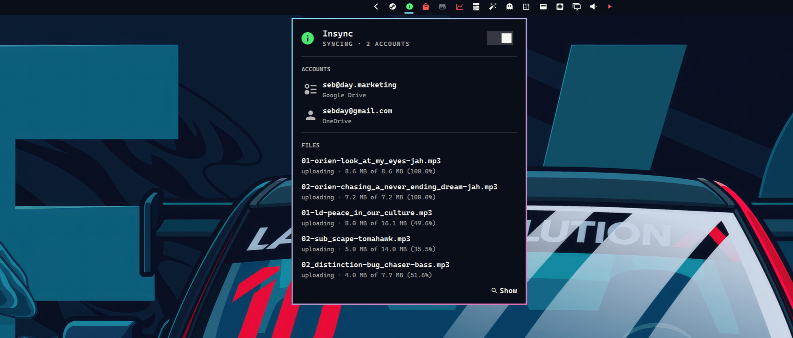

# Insync

Bar widget for [Insync](https://www.insynchq.com/) cloud sync: accounts, live file progress, and errors. 

I use Insync to sync my Google Drive and One Drive accounts into Linux. I think it's well worth the one time fee as there is nothing open-source that works as well or reliably.



## Install

A plugin is a git repo with a `manifest.json` at its root. Adding one clones it into `~/.config/omarchy/plugins/evo.insync/`.

```bash
omarchy plugin add https://github.com/sebday/omarchy-plugin-insync.git
omarchy plugin enable evo.insync
omarchy bar move evo.insync --section right
```

A local path works the same way.

Plugins run as unsandboxed code inside `omarchy-shell`. Review the files before enabling.

## Requirements

- [Insync](https://www.insynchq.com/) installed, with `insync` on `PATH`
- The Insync daemon running (`insync start`)

## Bar

| Click | Action |
|---|---|
| Left | Toggle the status panel |
| Middle | Open Insync as an Omarchy floating window |

The bar icon follows theme colours:

| State | Colour |
|---|---|
| Syncing, no errors | Accent |
| Errors or `ERROR` status | Urgent |
| Idle or paused | Foreground |

Hover shows the current status line (syncing, paused, error, or account count).

## Panel

Left-click the bar icon for a popup with:

- **Hero** — status, account count, and a pause/resume switch (same pattern as Audio and Dropbox)
- **Accounts** — email and provider for each linked cloud
- **Files** — up to five active transfers, with size and percent when Insync reports them
- **Errors** — items from `insync error list`
- **Show** — opens Insync tagged `floating-window` (Omarchy default: float, 875×600, centered)

The panel polls while it is open. With no files in flight it says "Nothing syncing"; "Insync unavailable" is only used when the daemon is down or `insync` is missing.

## IPC

```bash
omarchy-shell shell toggle evo.insync '{}'
omarchy-shell evo.insync refresh
```

| Call | Action |
|---|---|
| `open` / `show` | Open the panel |
| `close` / `hide` | Close the panel |
| `toggle` | Toggle the panel |
| `refresh` | Refresh status |

## License

MIT. See [LICENSE](LICENSE).
